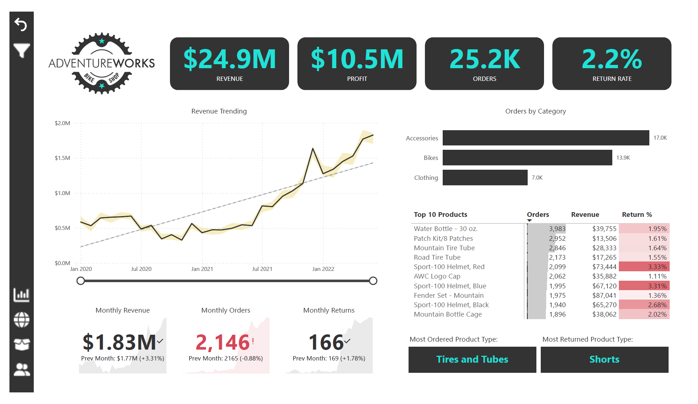

# AdventureWorks Sales Analysis - Power BI Report

## Overview
This Power BI dashboard provides a comprehensive analysis of AdventureWorks' sales performance, including revenue trends, product analytics, customer segmentation, and key business metrics. The report covers data from 2020 to 2022.

## Key Insights

### Financial Summary (Page 1)
- **Total Revenue**: $24.9M  
- **Total Profit**: $10.5M  
- **Orders**: 25.2K  
- **Return Rate**: 2.2%  

### Product Performance
- **Top Products**:  
  1. Water Bottle – 30 oz. (3,983 orders)  
  2. Park King Patches  
  3. Mountain Tire Tube  
- **Best-Selling Categories**:  
  - Bikes (17.0K orders)  
  - Clothing (13.9K orders)  
  - Accessories (7.0K orders)  

### Customer Analytics (Page 4)
- **Revenue per Customer**: $1,431  
- **Top Customers by Revenue**:  
  - Mr. Maurice Shan  
  - Mrs. Janet Munoz  
  - Mrs. Lisa Cai  
- **Orders by Income Level**:  
  - High Income: 2.8K  
  - Average Income: 11.6K  

### Geographic Distribution (Page 2)
- **Top Regions**:  
  - North America  
  - Europe  
  - Pacific  

## Interactive Features
1. **Drill-Down Capabilities**:  
   - Explore monthly trends for revenue, orders, and returns.  
   - Filter by product category or customer segment.  
2. **Product Deep Dive**:  
   - Analyze metrics like price adjustments, profit, and return rates for specific products (e.g., Water Bottle – 30 oz.).  

## Data Sources
- **Primary Tables**:  
  - Sales Orders  
  - Products  
  - Customers  
  - Geography  

## How to Use the Report
1. **Navigate Pages**: Use the tabs to switch between overview, product details, and customer insights.  
2. **Apply Filters**: Filter data by time period, region, or product category using the slicers.  
3. **Hover for Details**: Hover over charts to see tooltips with additional metrics.  

## Key Influencers (Page 7)
- **Home Ownership**: Likelihood increases by 15% when marital status is "Married."  
- **Retail Price**: Correlates with product cost (e.g., +$8,570 when product cost rises).  

---

### Notes
- **Data Period**: January 2020 – June 2022.  
- **Refresh Schedule**: Updated monthly.  
- **Power BI Features Used**: DAX measures, drill-through, tooltips, and AI-driven key influencers.  
